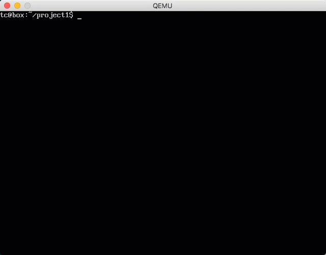
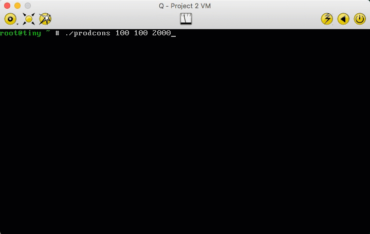

# OS-Projects
Programming projects for CS 1550 (Introduction to Operating Systems), lectured by Dr. Misurda at the University of Pittsburgh.

## Introduction
This directory contains the programming projects I completed for CS 1550 course in Fall 2017 at the University of Pittsburgh. There are four projects in total.

## Projects
### [Project 1: Double-Buffered Graphics Library]('project1')

### [Project 2: Syscalls and IPC]('project2')

### [Project 3: VM Simulator]('project3')

### [Project 4: File Systems]('project4')

## Disclaimer
If you are currently enrolled in CS 1550 at Pitt, please **DO NOT** use any code contained in this repository since it is likely a violation of course policies.
